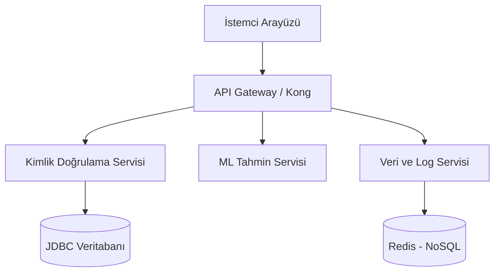

```markdown
# Dağıtık ML Model Yöneticisi (Distributed ML Manager)

[cite_start]Tamamen Java ile geliştirilmiş dağıtık bir makine öğrenmesi tahmin ve model yönetim sistemidir[cite: 8, 15]. [cite_start]Bu proje, TBL324 İleri Java Uygulamaları dersi için kapsamlı bir final mimarisi olarak kurgulanmıştır[cite: 7].

## 🏗️ Mimari Genel Bakış


[cite_start]Bu sistem, geleneksel monolitik bir yapı yerine, tamamen izole edilmiş ve birbirleriyle JSON üzerinden haberleşen dağıtık bir servis mimarisi kullanır[cite: 11]. [cite_start]Tüm gelen trafik, merkezi bir Gateway üzerinden ilgili API/Servis birimlerine yönlendirilir[cite: 11].



## 🚀 Geliştirme Kontrol Listesi ve Puanlama Tablosu

Bu proje, dersin hem zorunlu temel gereksinimlerini (65 Puan) hem de ileri seviye ek özelliklerini (35 Puan) eksiksiz karşılamayı hedeflemektedir.

### Zorunlu Kısım (65 Puan)

* [ ] **API & Back-end (10 Puan):** İş mantığını yürüten ve veriye erişim sağlayan arka yüz servisi.


* [ ] **Generic Yapılar (10 Puan):** Tip güvenliğini sağlamak ve kod tekrarını önlemek için `Generic<T>` sınıfların ve koleksiyonların kullanımı.


* [ ] **Custom GUI (10 Puan):** Standart bileşenlerin dışında Custom Graphics içeren, Swing veya JavaFX ile geliştirilmiş arayüz. (Not: Mobil GUI geliştirilirse bu isterin yerine geçer ve 10+5=15 puan olarak değerlendirilir )


* [ ] **JDBC & NoSQL (10 Puan):** Verilerin izole katmanlarda JDBC ve gerçek bir NoSQL motoru (Redis, MongoDB vb.) ile saklanması.


* [ ] **SOLID & OOP (10 Puan):** Nesne yönelimli prensiplere (SOLID, Design Patterns) tam uyum.


* [ ] **Hata Yönetimi (5 Puan):** API hatalarında standart HTTP durum kodlarının (4xx, 5xx) dönülmesi.


* [ ] **Performans Analizi & Dokümantasyon (10 Puan):** JMeter/k6 ile kırılma ve yük testlerinin yapılması, GitHub üzerinde Mermaid/Markdown ile teknik raporlama sunulması.


### Ek Özellikler (35 Puan)

* [ ] **Mikroservis Mimarisi (+10 Puan):** Monolitik API yerine birbirleriyle JSON üzerinden haberleşen izole dağıtık servis yapısı. (Zorunlu kısımdaki API puanı ile birleşip toplam 20 puan üzerinden değerlendirilir )


* [ ] **Gateway (+5 Puan):** Tüm trafiği yönetip ilgili birimlere yönlendiren Gateway (ör. Kong) yapısı.


* [ ] **Mobil GUI (+5 Puan):** Masaüstü arayüzüne ek olarak Android (Java) veya JavaFX/Gluon ile geliştirilmiş arayüz.


* [ ] **Test-Driven Geliştirme (TDD) (+10 Puan):** Red-Green-Refactor döngüsüyle, test dosyalarının tarih damgası kontrol edilerek geliştirme yapılması.


* [ ] **Dockerize Sistem (+5 Puan):** Tüm mimarinin (Veritabanı, Servisler vb.) `docker-compose up` komutuyla çalıştırılabilir olması.


```

***

Bu dosyayı repoya ekledikten sonra projenin iskeletini oluşturmaya geçebiliriz. Veritabanı (MySQL ve Redis) yapılandırmalarını barındıracak ilk `docker-compose.yml` dosyasını hazırlamamı ister misin?

```
